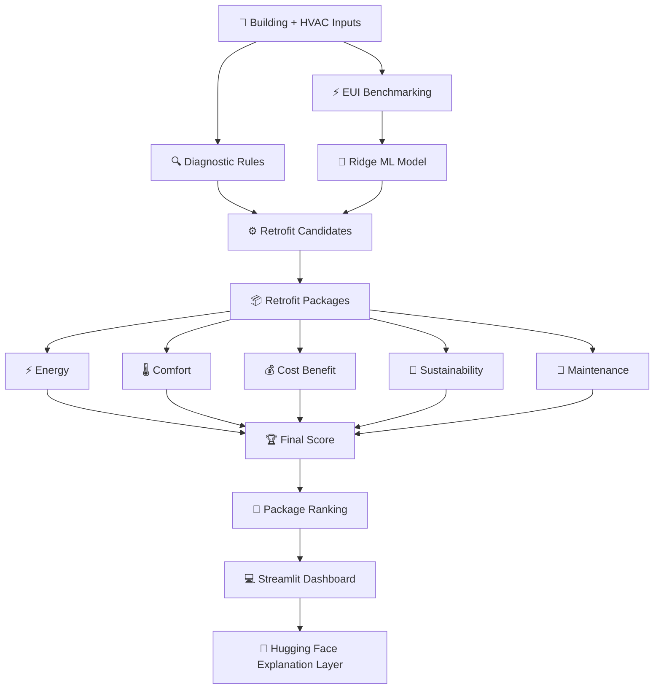

# ⚡ RETROFITIQ

## HVAC Retrofit Recommendation & Decision-Support Engine

> **From HVAC data to intelligent retrofit decisions.**

RetrofitIQ is a data-driven HVAC retrofit decision-support system that analyzes building characteristics, HVAC systems, energy performance, operational conditions, comfort, sustainability, maintenance, and financial feasibility to determine **which retrofit package is the most suitable for a building — and why.**

Unlike tools that only estimate energy savings, RetrofitIQ evaluates complete retrofit packages using a combination of:

**Energy • Comfort • Cost-Benefit • Sustainability • Maintenance • Diagnostics • Budget Feasibility**

**🏆 Round 2 | 🚧 Development in Progress | VIT Chennai**

----

# 🎯 What Are We Building?

RetrofitIQ answers one central question:

> **Which HVAC retrofit package is the best decision for this building — and why?**

The system does not simply recommend an individual HVAC measure.

It evaluates combinations of retrofit measures, estimates their impact, scores them across multiple decision criteria, checks budget feasibility, and ranks the resulting **complete retrofit packages**.

### The End Goal

**Building → Diagnose → Predict → Simulate → Score → Rank → Explain**

---

# 📌 Current Status

| Area | Status |
|---|:---:|
| Dataset Collection | ✅ Done |
| Data Cleaning & Processing | ✅ Done |
| Building EUI Benchmarking | ✅ Done |
| HVAC Diagnostics | ✅ Done |
| Energy Savings ML Model | ✅ Done |
| Retrofit Simulation Logic | ✅ Done |
| Financial Analysis | ✅ Done |
| Comfort Analysis | ✅ Done |
| Sustainability Analysis | ✅ Done |
| Maintenance Analysis | ✅ Done |
| Multi-Criteria Scoring | ✅ Done |
| Retrofit Package Generation | ✅ Done |
| Package Ranking | ✅ Done |
| Budget Feasibility | ✅ Done |
| Streamlit Dashboard | ✅ Done |
| Package-Level Decision Charts | ✅ Done |
| Hugging Face AI Explanation Layer | 🔄 Integrated / Testing |
| React Dashboard | ⏳ Future Enhancement |
| Full Production Validation | ⏳ Planned |

---

# 🧠 System Overview

```mermaid
flowchart LR

    A["🏢 Building & HVAC Inputs"]
    B["🔍 Diagnostics"]
    C["⚡ Energy Baseline"]
    D["🤖 ML Savings Prediction"]
    E["⚙️ Retrofit Candidates"]
    F["📦 Package Generation"]
    G["📊 Multi-Criteria Scoring"]
    H["💰 Financial Analysis"]
    I["🏆 Package Ranking"]
    J["🤖 AI Explanation"]
    K["💻 Streamlit Dashboard"]

    A --> B
    A --> C
    C --> D
    B --> E
    D --> E
    E --> F
    F --> G
    F --> H
    G --> I
    H --> I
    I --> J
    I --> K
    J --> K
````

---

# 📚 Data Sources

RetrofitIQ uses multiple datasets for different engineering and analytical purposes.

The datasets are **not blindly merged into one table**. Each dataset is used according to the information it can reliably provide.

### Primary / Supporting Data

| Dataset                        | Purpose                                                                                           |
| ------------------------------ | ------------------------------------------------------------------------------------------------- |
| **EESL Commercial Retrofits**  | Primary empirical retrofit, savings, financial, comfort, sustainability and maintenance reference |
| **BDG2**                       | Building energy-use benchmarking and EUI comparison                                               |
| **Indian Buildings Clean**     | Thermal comfort and indoor-condition context                                                      |
| **Indian Metro Weather**       | Exploratory climate and degree-day analysis                                                       |
| **Indian Buildings + Weather** | Building and climate context                                                                      |
| **Bldg59 Master Hourly**       | HVAC telemetry and operational diagnostics                                                        |
| **TestBedClean**               | Multi-zone / VAV operational diagnostics                                                          |
| **BuildHeat**                  | HVAC distribution and system context                                                              |
| **ASHRAE Cleaned Sample**      | Supporting building and HVAC reference                                                            |

### Data Categories

* 🏢 Building characteristics
* ❄️ HVAC systems
* ⚡ Energy consumption
* 🌡️ Indoor environmental conditions
* 👥 Occupancy
* 📡 HVAC telemetry
* 🌤️ Weather and climate
* 🔧 Maintenance indicators
* 🔄 Retrofit performance
* 💰 Financial parameters

---

# ⚡ Energy Baseline

RetrofitIQ first establishes the building's energy baseline.

### Energy Use Intensity

```text
EUI = Annual Energy Consumption / Floor Area
```

The building EUI is compared against peer-building distributions from the BDG2 dataset.

Reference points include:

* P25
* Median
* P75
* P90

This provides a benchmark for identifying relatively high-energy buildings.

---

# 🤖 Energy Savings ML Model

RetrofitIQ uses a **Ridge Regression** model to estimate package-level energy savings.

### Model Features

The current model uses:

1. Baseline EUI
2. Floor Area
3. Number of Floors
4. Smart Controls
5. AHU VFD
6. DCV
7. Chiller Optimization
8. Zoning Optimization

### Target

The model predicts:

```text
Package Energy Savings %
```

### Model Approach

```text
Building Features
       ↓
Standardization
       ↓
Ridge Regression
       ↓
Package Savings Prediction
       ↓
Engineering Context Adjustments
       ↓
Final Savings Estimate
```

The prediction is constrained to a prototype operating range of:

```text
10% → 45%
```

> **Important:** The current model is a prototype because the primary empirical retrofit dataset contains a relatively small number of projects. Predictions should therefore be interpreted as decision-support estimates rather than guaranteed field performance.

---

# 🔍 HVAC Diagnostics

RetrofitIQ includes an operational-condition diagnostic layer.

The diagnostic system evaluates issues such as:

* Poor zoning
* Ventilation imbalance
* Economizer faults
* Sensor mismatch

Diagnostic severity is represented on a:

```text
0 → 5
```

scale.

### Retrofit Gating

Certain diagnosed problems can directly activate relevant retrofit candidates.

| Diagnostic            | Candidate Retrofit  |
| --------------------- | ------------------- |
| Poor Zoning           | Zoning Optimization |
| Ventilation Imbalance | DCV                 |
| Economizer Fault      | Smart Controls      |
| Sensor Mismatch       | Smart Controls      |

AHU VFD and Chiller Optimization remain available as downstream retrofit candidates based on building and HVAC characteristics.

---

# ⚙️ Retrofit Strategies

RetrofitIQ currently evaluates five major retrofit measures.

| Retrofit                    | Purpose                                                   |
| --------------------------- | --------------------------------------------------------- |
| 🎛️ **Smart Controls**      | Improve scheduling, control logic and operating setpoints |
| 🌀 **AHU VFD**              | Adjust fan speed according to demand                      |
| 🌬️ **DCV**                 | Adjust ventilation according to occupancy/demand          |
| 🏢 **Zoning Optimization**  | Improve control and operation of individual zones         |
| ❄️ **Chiller Optimization** | Improve chiller operating efficiency                      |

The system evaluates these measures individually as candidates and then generates **complete retrofit packages**.

---

# 📦 Retrofit Packages

A major part of RetrofitIQ is the package-level decision engine.

Instead of only asking:

> "Which single retrofit saves the most energy?"

RetrofitIQ asks:

> **"Which combination of retrofits provides the most suitable overall decision for this building?"**

Package calculations include:

* Combined energy savings
* Package CAPEX
* Annual energy savings
* Annual monetary savings
* Payback
* Energy score
* Comfort score
* Cost-benefit score
* Sustainability score
* Maintenance score
* Final RetrofitIQ score
* Grade
* Budget feasibility

---

# 📈 Energy Impact

### Baseline Energy

```text
Baseline Energy = EUI × Floor Area
```

### Energy Saved

```text
Energy Saved =
Baseline Energy × Savings % / 100
```

### Post-Retrofit Energy

```text
Post Energy =
Baseline Energy − Energy Saved
```

### Combined Package Savings

For multiple retrofit measures:

```text
Remaining =
Π (1 − Individual Savingsᵢ / 100)
```

Therefore:

```text
Combined Savings % =
(1 − Remaining) × 100
```

This prevents package savings from being calculated as a simple addition of individual savings.

---

# 💰 Financial Analysis

RetrofitIQ evaluates the financial implications of each retrofit package.

### CAPEX

Package CAPEX is calculated as the sum of the applicable retrofit costs.

Current prototype rates include:

| Retrofit             | CAPEX Rate |
| -------------------- | ---------: |
| Smart Controls       |    ₹350/m² |
| AHU VFD              |    ₹333/m² |
| DCV                  |    ₹303/m² |
| Chiller Optimization |    ₹380/m² |
| Zoning Optimization  |    ₹308/m² |

### Annual Monetary Savings

```text
Annual Savings =
Annual Energy Saved × Electricity Tariff
```

The current default tariff is:

```text
₹9 / kWh
```

### Payback

```text
Payback =
Package CAPEX / Annual Savings
```

### Budget Feasibility

Packages are also checked against the building's available retrofit budget.

```text
Package CAPEX ≤ Available Budget
```

---

# 🌡️ Comfort Analysis

RetrofitIQ includes a thermal-comfort model using a **Random Forest Regressor**.

The current model uses:

* Indoor temperature
* Relative humidity
* Air velocity

to estimate thermal sensation.

### Model Configuration

```text
Model: Random Forest Regressor
Trees: 300
Minimum Leaf Size: 5
Train/Test Split: 80/20
Random State: 42
```

Because clothing insulation and metabolic rate are not available in the current dataset, the system does **not** claim to implement a full PMV/PPD calculation.

---

# 🌱 Sustainability Analysis

RetrofitIQ evaluates sustainability using CO₂-related impact estimates.

The sustainability layer uses empirical EESL references together with building-context adjustments such as:

* Floor area
* Building age
* HVAC characteristics
* HVAC distribution

The result is converted into a sustainability score used by the final decision engine.

---

# 🔧 Maintenance Analysis

Maintenance is included as one of the decision criteria.

The maintenance score considers:

* Building age
* HVAC characteristics
* HVAC distribution
* Empirical EESL maintenance references

Where historical maintenance information is directly applicable to an implemented retrofit, it can be incorporated into the building-specific assessment.

Otherwise, the system uses the relevant empirical group reference.

---

# 🏆 RetrofitIQ Scoring Engine

RetrofitIQ combines multiple decision dimensions into one final package score.

The current weighted score is:

```text
Final Score =
0.25 × Energy
+ 0.20 × Comfort
+ 0.25 × Cost Benefit
+ 0.20 × Sustainability
+ 0.10 × Maintenance
```

All component scores use a:

```text
1 → 5
```

scale.

### Weight Distribution

| Criterion         | Weight |
| ----------------- | -----: |
| ⚡ Energy          |    25% |
| 🌡️ Comfort       |    20% |
| 💰 Cost Benefit   |    25% |
| 🌱 Sustainability |    20% |
| 🔧 Maintenance    |    10% |

---

# 🏅 Package Grades

The final package score is converted into a grade.

|       Score | Grade | Interpretation     |
| ----------: | :---: | ------------------ |
|      ≥ 4.00 |   A   | Highly Recommended |
| 3.00 – 3.99 |   B   | Recommended        |
| 2.00 – 2.99 |   C   | Consider           |
| 1.00 – 1.99 |   D   | Low Priority       |
|      < 1.00 |   F   | Not Recommended    |

These grades are generated from the implemented scoring system.

---

# 🥇 Package Ranking

Complete retrofit packages are ranked using:

```text
1. Package Score ↓
2. Combined Savings % ↓
3. Payback ↑
```

The system therefore compares **complete packages**, rather than ranking individual retrofit measures as the final decision.

---

# 📊 Dashboard

RetrofitIQ currently uses a **Streamlit dashboard** for the working prototype.

The dashboard allows users to:

1. 🏢 Enter building characteristics
2. ❄️ Enter HVAC/system information
3. ⚡ Define energy and financial parameters
4. 🔍 Review operational diagnostics
5. ⚙️ Generate retrofit candidates
6. 📦 Compare complete retrofit packages
7. 💰 Review financial performance
8. 🏆 View package rankings
9. 🤖 Ask RetrofitIQ AI for an explanation

---

# 📈 Package-Level Decision Charts

The dashboard intentionally focuses its main decision visualizations on **complete retrofit packages**.

## 1. Retrofit Package Ranking

A horizontal bar chart displays:

```text
Highest Package Score
        ↓
Lowest Package Score
```

Each package can be inspected through tooltips containing:

* Rank
* Package
* Grade
* Package Score
* Combined Savings %
* CAPEX
* Annual Savings
* Payback

---

## 2. CAPEX vs Annual Savings

For every package rank, the dashboard displays:

```text
CAPEX        Annual Savings
  ████           ███████
```

The two financial values appear side-by-side for direct package-level comparison.

---

# 🤖 RetrofitIQ AI

RetrofitIQ includes a separate **LLM explanation layer** powered through the Hugging Face inference ecosystem.

The AI layer is designed to explain the calculations already produced by the engineering and scoring system.

### Architecture

```text
Engineering Engine
       ↓
Calculated Results
       ↓
Structured Context
       ↓
Hugging Face LLM
       ↓
Natural-Language Explanation
```

### The LLM Does

* Explain the selected package
* Explain why a package received its score
* Explain energy and financial results
* Explain diagnostics
* Explain trade-offs
* Answer questions about the displayed results

### The LLM Does NOT

* Change package scores
* Re-rank packages
* Invent savings
* Invent CAPEX
* Invent payback
* Override engineering calculations
* Generate unsupported accuracy claims

> **The engineering and scoring engine remains the source of truth. The LLM is an explanation layer, not the decision engine.**

---

# 🧠 Hybrid Architecture

RetrofitIQ intentionally combines machine learning with deterministic engineering logic.



---

# 🌤️ Climate Analysis

Climate normalization was explored during development using heating and cooling degree-day concepts.

Example calculations included:

```text
HDD18 = Σ max(0, 18 − Daily Mean Temperature)

CDD18 = Σ max(0, Daily Mean Temperature − 18)

CDD24 = Σ max(0, Daily Mean Temperature − 24)
```

However, climate normalization is **not currently used as a final model input** because of limitations in matching building locations, weather data and the available sample size.

> Climate calculations should therefore not be interpreted as part of the final RetrofitIQ recommendation unless explicitly included in the displayed result.

---

# 🏗️ Engineering Context Adjustments

The prototype includes deterministic context adjustments for HVAC characteristics.

Examples include:

* Chiller type and age
* AHU VFD status
* Building age
* HVAC distribution
* EUI percentile
* Existing system characteristics

These adjustments are applied alongside the ML estimate rather than replacing the ML model.

---

# 🗂️ Repository Structure

```text
RetrofitIQ/
│
├── data/
│   ├── raw/
│   ├── cleaned/
│   └── processed/
│
├── src/
│   └── Person D/
│       ├── app.py
│       └── llm_explainer.py
│
├── models/
│
├── notebooks/
│
├── reports/
│
├── .streamlit/
│   └── secrets.toml
│
├── requirements.txt
├── requirements_llm.txt
└── README.md
```

---

# 🛠️ Tech Stack

## Data & Machine Learning

**Python • Pandas • NumPy • Scikit-learn • SciPy • Joblib**

## Dashboard

**Streamlit • Altair**

## AI Explanation

**Hugging Face Inference Providers • OpenAI-compatible API**

## Machine Learning Models

**Ridge Regression • Random Forest Regressor**

## Engineering / Decision Logic

**Python • Deterministic Scoring • Financial Calculations • HVAC Diagnostics**

---

# 🚀 Running RetrofitIQ

Create/activate the Python virtual environment:

```text
.venv
```

Install dependencies:

```bat
pip install -r requirements.txt
```

For the LLM integration:

```bat
pip install -r requirements_llm.txt
```

Run the Streamlit application:

```bat
streamlit run "src\Person D\app.py"
```

The dashboard will open locally through Streamlit.

---

# 🗺️ Development Roadmap

## Phase 1 — Data Foundation

* [x] Dataset collection
* [x] Dataset cleaning
* [x] Dataset processing
* [x] Parameter selection
* [x] EUI benchmarking

## Phase 2 — Building Diagnostics

* [x] HVAC operational diagnostics
* [x] Poor zoning detection
* [x] Ventilation imbalance detection
* [x] Economizer fault detection
* [x] Sensor mismatch detection
* [x] Retrofit candidate gating

## Phase 3 — Energy Prediction

* [x] Define energy prediction features
* [x] Build baseline Ridge model
* [x] Train savings prediction model
* [x] Apply engineering context adjustments
* [x] Calculate baseline energy
* [x] Calculate post-retrofit energy
* [x] Calculate energy savings

## Phase 4 — Retrofit Evaluation

* [x] Smart Controls
* [x] AHU VFD
* [x] DCV
* [x] Zoning Optimization
* [x] Chiller Optimization
* [x] Individual retrofit calculations
* [x] Retrofit package generation
* [x] Combined package savings

## Phase 5 — Decision Engine

* [x] Energy scoring
* [x] Comfort scoring
* [x] Cost-benefit scoring
* [x] Sustainability scoring
* [x] Maintenance scoring
* [x] Final weighted score
* [x] Package grading
* [x] Package ranking
* [x] Budget feasibility
* [x] Payback calculation

## Phase 6 — Dashboard

* [x] Building input interface
* [x] Energy baseline display
* [x] Diagnostic results
* [x] Retrofit candidate display
* [x] Package comparison
* [x] Package ranking
* [x] CAPEX vs Annual Savings chart
* [x] Package-level tooltips
* [x] Financial analysis
* [x] Selected package explanation

## Phase 7 — AI Explanation

* [x] LLM explanation layer
* [x] Hugging Face integration
* [x] Structured RetrofitIQ context
* [x] Grounded explanation prompts
* [x] Dashboard AI question panel
* [ ] Full end-to-end LLM testing

## Phase 8 — Future Development

* [ ] Larger validated retrofit dataset
* [ ] Expanded model validation
* [ ] Additional building types
* [ ] More detailed simulation validation
* [ ] Production deployment
* [ ] React frontend
* [ ] Full backend/frontend separation
* [ ] End-to-end production testing

---

# 🚨 Development Principles

RetrofitIQ follows several principles throughout development.

### 1. Engineering Before AI

```text
Data
 ↓
Engineering Logic
 ↓
ML Prediction
 ↓
Decision Engine
 ↓
AI Explanation
```

The LLM does not replace the engineering calculations.

### 2. Explainability

Every important recommendation should be traceable to:

* Building inputs
* Dataset references
* Model outputs
* Engineering assumptions
* Scoring formulas
* Financial calculations

### 3. No Invented Results

RetrofitIQ avoids:

* ❌ Invented energy savings
* ❌ Fake ML accuracy
* ❌ Fabricated CAPEX
* ❌ Unsupported payback values
* ❌ Hardcoded recommendations
* ❌ Unsupported climate claims
* ❌ Presenting assumptions as measured results

### 4. Package-Level Decision Making

The final recommendation focuses on **complete retrofit packages**, not isolated measures.

### 5. Prototype Transparency

Where datasets are small or assumptions are required, the system clearly identifies the result as a prototype estimate rather than claiming field-level accuracy.

---

# ⚠️ Current Limitations

RetrofitIQ is currently a research/prototype decision-support system.

Important limitations include:

* The primary empirical retrofit dataset is relatively small.
* Energy savings predictions should be treated as estimates.
* Full physics-based simulation is not currently used as the final engine.
* Thermal comfort modelling does not currently implement complete PMV/PPD because clothing and metabolic inputs are unavailable.
* Climate normalization is exploratory and not part of the final recommendation model.
* Retrofit CAPEX values are prototype assumptions/reference rates.
* The system requires further validation against larger real-world retrofit datasets.
* Production deployment and large-scale testing are future work.

---

# 👥 Team Prehistoric Humans

### Vellore Institute of Technology, Chennai

* **Jaagriti Mandal**
* **Swati Yadav**
* **Ashita Kuchhal**
* **Aneesha Yadav**

---

# 🚀 RetrofitIQ

## HVAC Data → Diagnostics → ML Prediction → Retrofit Packages → Impact Analysis → Ranking → Intelligent Explanation

**🏆 Round 2 — Development in Progress**

> **RetrofitIQ doesn't just ask how much energy a retrofit can save.**
>
> **It asks which retrofit package makes the most sense for the building — and why.**

```
```
